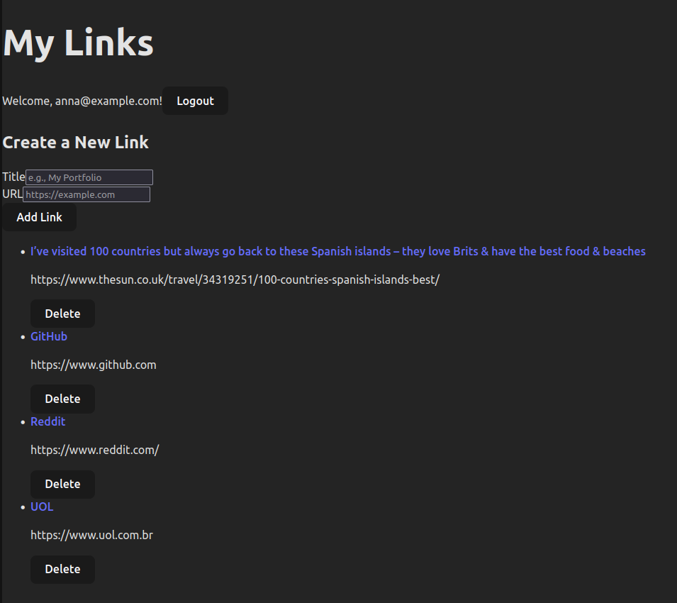

LinkFolio - Your Personal Link Hub

## 📸 Screenshot



A full-stack, authenticated link-sharing application built with the PERN stack (PostgreSQL, Express, React, Node.js) and containerized with Docker.

## 📖 About The Project

LinkFolio is a complete, single-user "link-in-bio" style application. After registering and logging in, a user can manage a personal list of links on a secure dashboard. This project was built from the ground up to demonstrate a full range of full-stack development skills, from database design and secure API creation to building a dynamic, interactive frontend with React.

The entire development environment is containerized using Docker and Docker Compose, ensuring a consistent and reproducible setup for both development and a potential future deployment.

## ✨ Key Features

    Secure User Authentication: Full registration and login system using JWTs (JSON Web Tokens) for secure, stateless sessions.

    Password Hashing: User passwords are never stored in plain text, using bcrypt for industry-standard hashing.

    Protected API Routes: Middleware ensures that only authenticated users can access or modify their own data.

    Full CRUD Functionality: Users can Create, Read, and Delete their personal links.

    Relational Database: A PostgreSQL database with a clear relational schema connecting users to their links.

    Dynamic React UI: A client-side application built with React, featuring hooks (useState, useEffect, useContext) for state management and interactivity.

    Global State Management: React's Context API is used to manage the user's authentication status across the entire application.

    Containerized Environment: The entire application (Node.js server and PostgreSQL database) is managed by Docker Compose for a consistent and isolated development environment.

## 🛠️ Tech Stack

This project was built using the following technologies:

### Backend:

    Node.js: JavaScript runtime environment.

    Express.js: Web framework for building the REST API.

    PostgreSQL: The relational database.

    Prisma: Next-generation ORM for database access and migrations.

    JWT (jsonwebtoken): For creating and verifying authentication tokens.

    bcrypt: For hashing user passwords.

### Frontend:

    React: JavaScript library for building the user interface.

    Vite: Modern, fast frontend build tool.

    TypeScript: For static typing and a more robust codebase.

    React Router: For client-side routing.

    Tailwind CSS: For styling the user interface.

### DevOps:

    Docker & Docker Compose: For containerizing the application and database.

## 🚀 Getting Started

To get a local copy up and running, follow these simple steps.
Prerequisites

You must have Docker and Docker Compose installed on your local machine.
Installation & Launch

    1.  **Clone the repository**
    ```sh
    git clone [https://github.com/claytoncrispim/link-folio.git](https://github.com/claytoncrispim/link-folio.git)
    ```
    
    2.  **Navigate to the project directory**
    ```sh
    cd link-folio
    ```

    3. **Create your local environment file:**

        Create a new file named .env in the root of the project.

        Add the following variables. You can generate a new random string for the JWT_SECRET.

    DATABASE_URL="postgresql://user:password@db:5432/linkfolio?schema=public"
    JWT_SECRET=YourSuperLongAndRandomSecretStringGoesHere
    CLIENT_ORIGIN_URL=http://localhost:5173

    4. **Launch the Docker Environment:**

        This single command will build the server image, start the database, and launch the application.
    ```sh
    docker compose up --build
    ```
    
    5. **Launch the Frontend Client:**

        Open a second terminal.

        Navigate into the client directory and start the Vite dev server.
    ```sh
    cd client
    npm install
    npm run dev
    ```

    6. **Open the app:**

        Open your browser and navigate to http://localhost:5173. You can now register, log in, and use the application!

🔗 Live Demo

(Deployment section to be added in the future)